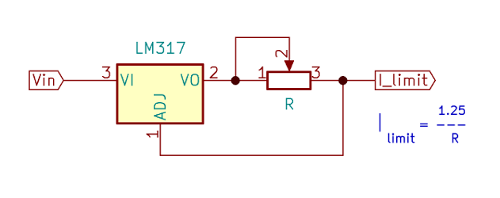

# Current Sources

## LED Series Resistor

An LED needs a current source. 
The voltage is not so relevant, as long as it's bigger than the diode voltage drop.

The easiest way is a resistor to limit the current.

$` R = ( U - U_{LED} ) / I_{LED} `$

## LM317 as Precision Current-Limiter

## Diode Current Source

The diode current amd voltage drop can be used to regulate the current $` I_R2 `$ through a transistor.

Resistance $` R_2 `$ is calculated as 

$$ R_2 = \frac {V_D - V_BE}{I_R2} $$

and $` R_1 `$ as
$$ R_1 = \frac{V_S - V_D}{I_D + K \cdot I_B} $$

where $` I_D `$ is the LED current and  $` I_B `$ base current of NPN transistor 

--- 

[back](../README.md)