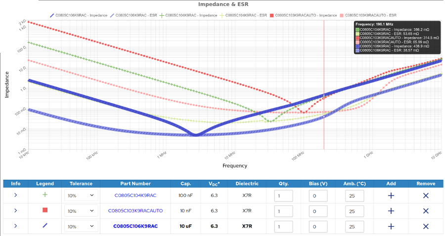

# Decoupling capacitors

ICs with the need to generate quick raise from 0 V to Vcc need a quick current pulse.
Since any cable or PCB has an impedance depending on the way the current has to travel, the current cant deliver high slew rates.
In digital circuits in the MHz region this can lead to malfunction.

Ideally, the impedance of your power delivery network should be flat within the band you want to work. 
A fourier analysis of a rectangular signal shows, that it's composed of sine waves with a lot upper harmonics. 
Simplified: If these higher frequencies have higher resistance the signal is washed out.

The solution: Place a capacitor with a low ESR as close as possible to the (every) ICs Vcc Pin to GND. 
This can also prevent ICs from unwanted self oscillating (e.g. 78xx regulators).

In SMD designs any low ESR capacitor (MLCC) with high enough capacitance can be used.
The SMD capacitor must be placed as close as possible to the ICs Vcc pin. 
Since the ICs are also very small (internal bonding cable length), the Vcc impedance can then be neglected.

It is always mentioned, that smaller capacitors wor better at higher frequencies or a combination of different values wor best.
This is in general not true.

Example: A 100 nF X7R 0805 has its lowest impedance at ca 30 MHz and even at 200 MHz its only 390 $m\Omega$. 10 uF has only 15% higher impedance at 200 MHz. A 10 nF has 320 $m\Omega$ at 200 MHz. By this a 10 nF performs not much better than a 100 nF or a 10 uF at this frequency. Placement on the PCB or any via may make a bigger difference.

(Source: https://ksim3.kemet.com/capacitor-simulation)

In case you face slew rate problems with a 100 nF SMD MCLL, you must carefully select a capacitor type and value to work best at for the desired rise time (which might be much faster than the clock speed of the circuit).

For THT designs it's more complex since the effective distance between the capacitor and the IC semiconductor is typically in the cm range.
A combination of different sized capacitors can help to mitigate this issue.
