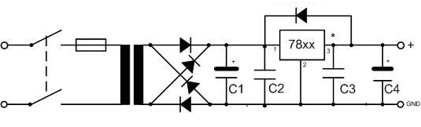
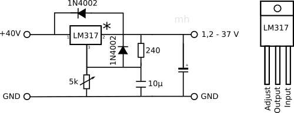

# Linear Regulator Power Supply

Linear regulators can be used generate a lower voltage from a higher input voltage. 
The circuit is easy. Since they generate heat out of the voltage drop when current flows, 
line regulators should only be used for small voltage drops and low current.

## 78xx and 79xx

78xx and 79xx regulator ICs  
- have 3 pins (input, ground, output) 
- need capacitors at input and output plus a protection diode to work
- the xx in the type number refers to the output voltage
- 78xx are positive voltage regulators
- 79xx are negative voltage regulators
- need cooling depending on the current they have to deliver

- Smoothing capacitor C1 is an ELko, big enough, that the input voltage never drop near or below output voltage
- C2 and C3 prevent oscillating at high frequencies and must have small impedance. 
  This implies, that they are placed really close to the regulator. Foil capacitors of 100 nF are recommended.
- C4 cover current peaks 

## LM317

Using e.g. the LM317 the output voltage can made variable between 1.2 V and 37 V.

The LM317 datasheet also describes further interesting circuits:
- 0-V to 30-V Regulator Circuit
- Adjustable Regulator Circuit With Improved Ripple Rejection
- Precision Current-Limiter Circuit
- Tracking Preregulator Circuit
- 1.25-V to 20-V Regulator Circuit With Minimum Program Current
- Battery-Charger Circuit
- 50-mA Constant-Current Battery-Charger Circuit
- Slow Turn-On 15-V Regulator Circuit
- AC Voltage-Regulator Circuit
- Current-Limited 6-V Charger Circuit
- Adjustable 4-A Regulator Circuit
- High-Current Adjustable Regulator Circuit

[back](../README.md) 