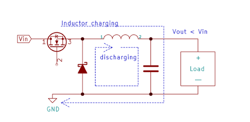
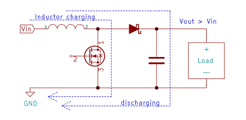
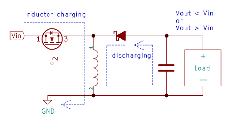
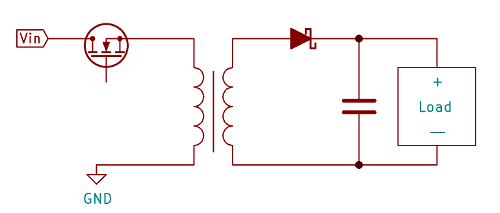

# Switch Mode Power Supplies (SMPS)
Here only yhe basics are explained. 

In real world integrated circuits are available to do switching and voltage sensing. 
Some even have the diode built in, so zou only need to add an inductor, a capacitor and some resistors to select the output voltage.

SMPS are high efficient, losses can be less than 10%. 

SMPS can introduce heavy noise, but using filters and with a good design, the noise can be minimized, so they can even used 
to supply critical circuits (e.g. pro audio).

Since the input voltage should be DC, but quality and voltage are not critical, the rectification can be simplified. 
Sometimes only one diode and a small capacitor are used. 
The problem is: Some converters are *not* isolated to the input (buck boost, ...). 
Rectification of line voltage generates dangerous high voltages, so using non-isolated converters are a no-go there.

# Non-isolated DC-DC converters

## Buck Converter

Buck converters are step-down converters, means the output voltage is lower than the input.

The basic functionality is simple:
1. A current pulse "charges" an inductor with energy (remember, capacitors are conductive for pulses or HF)
2. If the current is switched off, the inductor discharges (remember, the inductor "want to maintain" the current) and charges the capacitor.
3. The capacitor is charged to the desired output voltage.
4. The load takes energy out of the capacitor and discharges it
5. If the voltage at capacitor drops below a threshold, repeat step 1 and 2

If the switching cycle is done fast, the inductor and capacitor can be small, this is why 

## Boost Converter

Boost converters are step-up converters, means the output voltage is higher than the input.

The basic functionality again is simple, if you understand the buck converter, you should easily derive how boost is working.

## Buck/Boost Converter

Buck/boost converters can generate higher or lower voltage at the output relative to the input.

Buck/boost converters are e.g. a solution in battery powered circuits: 
Where the voltage is higher than required when the battery is charged,
but the battery voltage is below the desired output voltage when the battery is discharged.

# Isolated DC-DC converters

## Flyback Converter

This converter generates a DC voltage isolated from the input voltage.
 

A feedback is required to control the switch for the desired output voltage.
This feedback is typically done with a optocoupler to keep the isolation from the primary and secondary side.

## Push Pull Converter

TODO

## Half Bridge Converter

TODO

## Isolated Cuk Converter

TODO

[back](../README.md) 