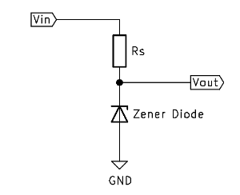

# Zener Diode Regulator

Zener diodes can be used to produce a stabilized voltage output with low ripple under varying load current conditions. 

The diode is reversed, but Zener diodes have a specific reverse break down voltage. 
Rs limits the current.

[back](../README.md) 